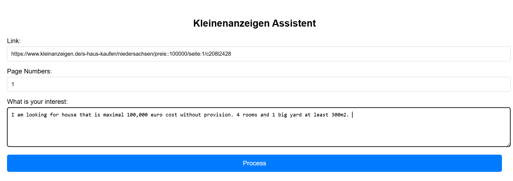

# Kleinanzeigen Assistent  
Kleinanzeigen Assistent is an intelligent search assistant for eBay Kleinanzeigen that helps users find housing ads based on personalized preferences.  
Instead of being limited to standard search filters, users can describe what they are looking for in natural language. The assistant then uses a Large Language Model (LLM) to match and refine relevant listings.  

## Tech Stack  
- **Frontend:** React.js  
- **Backend:** CrewAI (Python)  
- **Language Model:** LLM (via Ollama)  

## Installation  
1. **Clone the repository:**  
   ```
   git clone https://github.com/almkdad-bashar/kleinanzeigen_assistent
   cd kleinanzeige-assistent
    ```

2. **Configure the LLM connection:**
   Edit:
   ```
   backend/purchase_copilot/src/purchase_copilot/llm_config.py
   ```

   Example:
   ```
   llm = LLM(
       model="ollama/qwen3:1.7b",
       base_url="http://172.17.0.2:11434"
   )
   ```

3. **Start the backend server:**

   ```
   cd backend/server
   python server.py
   ```

4. **Start the frontend:**

   ```
   cd frontend
   npm run dev
   ```

5. **Fill in the fields in the UI:**

   * **First field:** URL to start searching on Kleinanzeigen
   * **Second field:** Number of pages to cover
   * **Third field:** User preferences in natural language



6. **Start the process** 🚀


